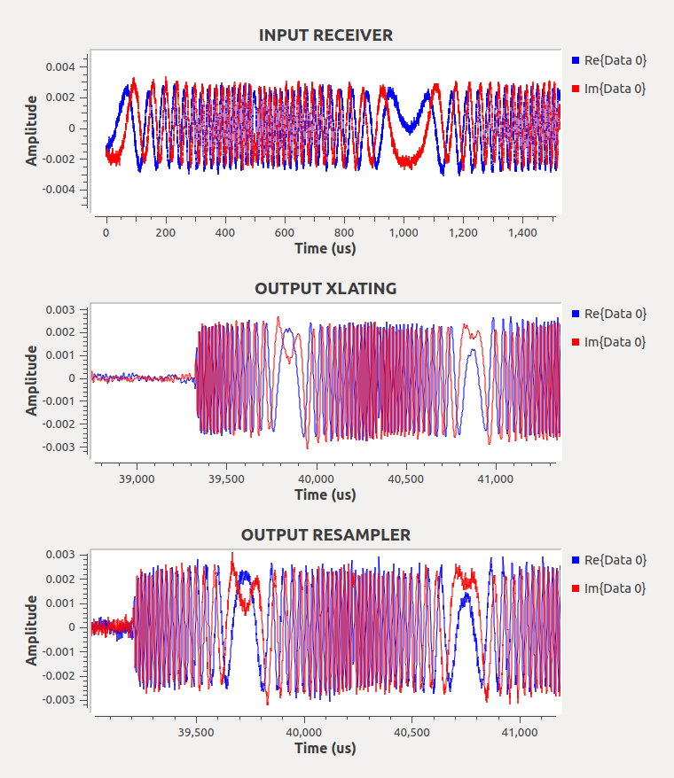

## Introduction
This project implements a LoRa receiver in Python bypassing the GNURadio framework. It extends from the code in [1]. It uses swig to wrap the C++ functions from [1] and creats a Python interface. In this way, the C++ functions are accessible from Python, which allow for a faster and reliable execution of the LoRa receiver. The main python script (*lora_receiver.py*) reads IQ samples from a file and decodes the LoRa header and payloads.

## Project hierarchy

The project is structured as follows:

1. **data**: Contains the bin files with the IQ samples. Initially, it contains the input to the LoRa receiver. During the execution, the data from intermediate stages are also stored in this folder.
2. **ext**: Hosts external repositories (gr-lora). Though not needed, it helps debubgging.
3. **python**: Contains the main receiver script *lora_receiver.py* and other testing scripts that assess the correction of the intermediate blocks (resampler, xlating FIR filter and LoRa decoder).
4. **src**: Contains the source code and headers (.cc and .h) that form the lora library (*_lora_id.so*).
5. **swig**: Swig files to wrap the C++ code. The library is generated under the name *_lora_id.so*.

## Installation

The code has the following pre-requisites:
* liquid: Software-Defined Radio Digital Signal Processing Library. See https://liquidsdr.org
* volk: Vector-Optimized Library of Kernels (VOLK). See http://libvolk.org.
* swig: Simplified Wrapper and Interface Generator (SWIG). See http://www.swig.org/.

The code requires swig with version 3.0.12 or above. The root folder includes aa script to install version 3.0.12:

```Bash
./install_swig_3-0-12.sh
```

The libraries liquid and volk are automatically installed if needed when running the overall compilation and install script of the project (*INSTALL*). To compile and generate the libraries and python-based LoRa receiver, please run the script below. 

```Bash
./INSTALL.sh
```

This creates the library (.so) and the python API and places them under folder *python*. Once the compilation is complete, you can ensure the correctness of the library by running the script below. This imports the lora module, prints the available (public) functions of the blocks within and instantiates a channelizer module.

```Bash
(cd python; python -c "import lora_id; print(dir(lora_id)); print(lora_id.decoder(10e6,7)); print(lora_id.channelizer(10e6,1e6,905e6,[905e6]))")
```

### Run LoRa receiver

To run the LoRa receiver using a sample input of IQ samples, use the script *python/lora_receiver.py*. This iterates over the three main DSP blocks (resampler, xlating FIR filter and decoder). The first two blocks form the so-called channelizer block. The execution prints out the decoded header and payloads in hexadecimal values.

```Source
 Process name:  lora-decoder
***********************************
[CHANNELIZER] - Creating Channelizer
[FREQ XLATING FIR FILTER] - Creating Freq. XLating FIR Filter
[FRACTIONAL RESAMPLER] - Creating Fractional Resampler
[MMSE FIR INTERPOLATOR] - Creating FIR filter
[MMSE FIR INTERPOLATOR] - NTAPS:8
[MMSE FIR INTERPOLATOR] - NSTEPS:128
[FRACTIONAL RESAMPLER] - To generate 1 output sample we require 18 samples at the input.
[CHANNELIZER] - Expected ratio IN/OUT: 10
[DECODER] - Creating Decoder
Bits (nominal) per symbol:  3.5
Bins per symbol:  128
Samples per symbol:   1024
Decimation:     8
Running channelizer Resampler...
Writing output samples from the PyLoRa channelizer/resampler block in ../data/py_lora_output_resampler
Running channelizer Xlating FIR Filter...
Writing output samples from the PyLoRa channelizer/Xlating_FIR block in ../data/py_lora_output_xlating
Running decoder...
...
Demod and decode of header success. Printing header 
 0c 30 a0
Demod and decode of Payload success. Printing payload 
 c3 11 74 00 ef 55 00 00 00 00 00 00 00 00
Demod and decode of header success. Printing header 
 0c 30 a0
Demod and decode of Payload success. Printing payload 
 c3 11 74 00 ef 55 00 00 00 00 00 00 00 00
Demod and decode of header success. Printing header 
 0c 30 a0
Demod and decode of Payload success. Printing payload 
 c3 11 74 00 ef 55 00 00 00 00 00 00 00 00
Demod and decode of header success. Printing header 
 0c 30 a0
...
```

## Debugging

By default, the logger in the C++ library is deactivated. To activate it, please include the flags "*-D _DEBUG*" when compiling it inside the *INSTALL* script.

In addition and since the code extens mainly from [1], we modified it a bit to include some of the debugging functionalities within the blocks and created the extension in [2]. This repository is private but we'll happily provide you access to it if needed. The code in [2] is already a sub-module of this repo and we just need to run the following:

```Source
>> git submodule update --init --recursive
```

Please, make sure to checkout the branch *pyLoRa_v1*.

To run the main LoRa receiver, please run the script *lora_receive_file.grc* (in gnuradio-companion). This visualizes the input and output samples from the intermediate stages in the execution.

<p align="middle">

</p>

To ensure the correctness of the proposed Python-based LoRa blocks, one could take the outputs that are generated by *lora_receive_file.grc* (stored under *misc/data*) and use the scripts below with such inputs. Make sure to configure the input fileName according after executing the grc flowgraph.

```Source
python python/lora_channelizer_resampler.py
python python/lora_channelizer_xlating.py
python python/lora_decode.py
```

## TO-DO

The swigged method to convert nparrays from Python into C++ pointers takes a long time to execute. This is because the conversion is done value to value (copy operation). This is the function *set_grcomplex* under *lora.id*, called multiple times in the *lora_receiver.py* and other testing scripts. We need to work on a faster method.

## Contact

For more information about the code, please don't hesitate to contact me by email. I'll be happy to assist you and answer any question you may have.

Carlos Bocanegra Guerra  
PhD Candidate  
Electrical and Computer Engineering (EECE)  
Northeastern University  
bocanegrac@coe.neu.edu

## Cite

## References

[1] https://github.com/rpp0/gr-lora
[2] https://github.com/Subhramoy/gr-lora